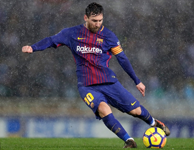
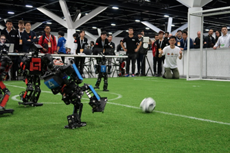
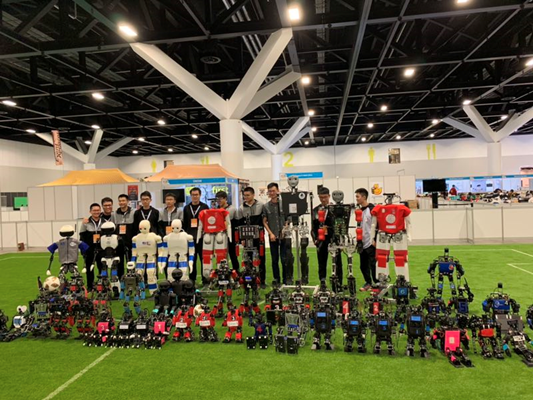

# ZJUDancer 小仿人机器人组2019年火热纳新进行中，期待你的加入！

你眼中的足球，可能是这样的

而我们眼中的足球，还可以是这样的

上图就是我们的机器人在上周刚刚结束的2019年澳大利亚悉尼Robocup机器人比赛上留下的飒爽英姿，浙江大学ZJUDancer团队以6胜1负的战绩夺得Robocup类人组中KidSize组别的亚军。下面就让我们一步步了解Robocup和我们的团队。

## 01 Robocup比赛简介
Robocup是Robot World Cup的简称，是一场机器人的足球世界杯，是世界上规模最大的机器人比赛。Robocup的目标是在21世纪中期，足球机器人的队伍能与人类世界杯冠军进行PK。Robocup比赛项目众多，大致可分为仿真和实物比赛，而实物比赛又分为类人、轮式、家庭服务等多个项目。  	

我们的ZJUDancer团队参加的就是类人组（Humanoid League）中的KidSize足球比赛：类人组相对于其他组别的最大特点就是其外形和行为特征必须与人类相似，比赛时在一个4对4的足球赛场上，各队机器人需要依靠自己的摄像头、陀螺仪等传感器传来的实时数据，按着自己的程序，完全独立地在场上进行活动。不同机器人间还会相互通信、协作，并要听从裁判发出的指令。正是由于机器人的完全自动，比赛的刺激程度丝毫不亚于真人足球。

## 02 ZJUDancer团队简介
ZJUDancer依托于工业控制技术国家重点实验室、浙江大学机器人科教实践基地，成立于2006年，在建队10多年的时间里，ZJUDancer从独立自主设计制造机器人，到完善步态、策略等模块代码，逐渐成长为一支有极强竞争力的类人组机器人强队，十年间，ZJUDancer获国内外荣誉无数：7次获得Robocup中国公开赛类人组总冠军；从2013年开始，两次获得世界赛类人组KidSize季军，四次获得世界赛类人组Kidsize亚军。

除了比赛的目标，ZJUDancer还支持其他相关研究。在今年的比赛中，我们将有大量待改进和优化的算法，从策略提升和路径规划到步态稳定性的提高。对积极主动、有热情、愿意坚持到底的同学，我们可以帮你向本学院机器人实验室指导老师申请SRTP、省创或其他项目的课题，并且有充足的经费，以及机器人实验室的导师、研究生给你亲自指导。

最终，我们将根据各位一年的努力成果和能力，选拔约10人参加2020年于法国举办的RoboCup机器人机器人世界杯。

澳大利亚赛类人组合照：

## 03 团队分组介绍
优秀的团队工作必然要进行适合的分工，同样，ZJUDancer团队分为以下四个小组进行工作，分别是软件组（识别、策略）、步态组（运动控制）、电路组和机械组。
### 软件组：
软件组的主要负责部分包括：
**视觉：**让机器人能够根据摄像头感知周围环境。
**定位：**使机器人根据周围环境获得自己在比赛场地上的位置。
**策略：**机器人单体的进攻、防守策略及机器人间的协作策略。
**其他：**各种软件方面任务，包括机器人间的通信、获取裁判盒指令等通信部分，开发、调试、监控用工具的维护及更新等。

去年我们更新了视觉识别的网络，检测更加快速、准确，并且改善了自定位的稳定性，机器人单体作战的强度与稳定性都有所提高。在此基础上，我们着重改进了机器人间的协作与分工策略，并应用于今年的悉尼世界赛上，最终机器人的进攻效率、防守能力都有了很大的提高。

下一年我们将尝试针对不同策略角色特化其视觉与自定位，并致力于实现机器人间更为流畅的协作。而通用的视觉与定位方面也需要进一步强化，使机器人感知到更多、更准确的场地与周围环境信息。

### 步态组：
仿人组机器人最大的特点就是机器人要完成和人类相似的动作，如走路、踢球和爬起等等，步态组要完成的就是机器人在赛场所有动作的实现以及多种动作的配合和接续，这需要从了解机器人底层控制开始，到机器人运动学、动力学模型的构建，再到单个动作的调试和优化，以及在ROS系统的通信架构的基础上，让走路、球前调整、踢球、爬起等动作在赛场上完成良好衔接，并且要将所有动作和场上策略配合起来。

去年我们将步态多年累积的代码进行了重构，并对底层硬件的IO进行了优化，比赛时也使用了今年完成的新代码，可以说处于新老交替的时间，目前已经打好了步态的基础，也具有了清晰的体系，但从比赛的实际情况可以看出，新代码的细节仍不够完善，踢球、走路等动作还需要进行优化，所以下一年我们将在新代码的基础上进行优化和体系的不断完善，主要集中于踢球的优化、走路稳定性的提高、步态动作的流畅衔接等方面。

步态组的任务复杂而有趣，可以说是上要和顶层的软件组的策略配合、下要对底层的舵机硬件进行控制，如果你想让赛场的机器人动作出自你手，欢迎加入步态组。

### 电路组：
电路组的主要工作是电路原理图设计、PCB设计焊接调试、嵌入式程序开发、机器人日常维护等。

今年将进行新下位机代码功能完善与优化和测试新传感器等工作。涉及的知识有模电数电原理、PCB设计原理、嵌入式编程语言（以Ｃ为主）

### 机械组：
在仿人足球赛场上，如何让机器人踢得更远、如何让机器人在身体对抗中取得优势、如何让机器人在摔倒后更快地爬起，往往是决定一场比赛胜负的关键，而这些，都与机械组息息相关。

作为机械组成员，围绕如何提高机器人的硬件性能和稳定性，我们展开一系列设计、加工以及维护工作。在这里，你可以实践你的机械设计知识，你的所有创意和设计都有机会变成实物并亲手组装，而且你将会通过组装和维护机器人极大地提高你的动手能力和解决问题的能力，通过与其他组必要的合作而学习到关于仿人机器人的从机械到电路再到软件的各方面知识。

## 04 纳新报名

### 纳新对象：

主要面向2017级、2018级本科生，也欢迎其他对机器人有兴趣、充满热情的同学。

### 纳新题目：

本次纳新分为**暑期课题**与**开学面试**两部分，各组发布的课题详见[GitHub](https://www.github.com/ZJUDancer/Joinus-2019)。

请各位根据自己的兴趣及实际情况选择合适课题进行研究，并**尽量详细地将研究过程整理出一份文档**，方便我们了解各位的工作情况。最终，暑期课题优秀的同学可以**免除面试过程，并提前进入实验室**。我们更看重各位的研究过程，即使结果并不理想也能通过我们的审核，各位可以大胆挑战有难度的题目。

欢迎对课题有疑问的同学与我们联系，提出问题或者意见。联系方式请参考各组课题文件，或在文末公布的群内直接联系我们。

开学后的面试时间将在开学后另行通知，请各位关注文末群内通知或本贴更新。

### 各组要求：

#### 软件组：
软件组涉及方面较多，各位可以自由选择发展和研究的方向，我们对队员的要求只有两条：

- 有足够多的时间在队内学习研究；
- 有对小仿人机器人的充足热情！

如果你有以下的特长，我们更加欢迎：

- 熟悉C++、Python等编程语言；
- 熟悉ROS框架；
- 了解深度学习的基本概念，以及目标检测方面的知识。

#### 步态组：

- 熟悉C/C++编程语言
- 学有余力，平时能投入较多时间在实验室
- 有较强的学习能力和团队协作精神

如果你有以下特长，我们更加欢迎：

- 熟悉ROS框架
- 熟悉机器人学相关知识（正逆运动学等）

#### 电路组：

- 具备基本模数电知识并有一定焊接能力
- 心态平和，可以应对并解决硬件测试中出现的众多问题
- 有较多电路板开发绘制经验者优先，熟练使用AD软件者优先
- 有一定单片机开发经验者优先，具有STM32开发经验者优先，51单片机亦可

#### 机械组：

- 热爱机械设计，最好能提供一些平时设计、制作的小装置。如果没有，纳新题目中的普通题与拔高题也是你表演的舞台；
- 接触过AutoCAD、Solidworks等机械设计软件，如曾应用到实际科研或者学习中更佳；
- 有较强的责任感和团队合作精神，曾参与团队机器人项目或者比赛的会优先考虑；
- 愿意将学习生活以外的部分日常时间投入到仿人组的工作中，因为机器人的制作是繁琐且耗时的，只有充足的时间投入才可能将其做好、做到位。

## 05 联系我们

为了集中回答各位对我们队伍、对题目的相关问题，我们建立了QQ群（群号：695805431），欢迎各位加入讨论：

我们是ZJUDancer，衷心期待各位的加入！
